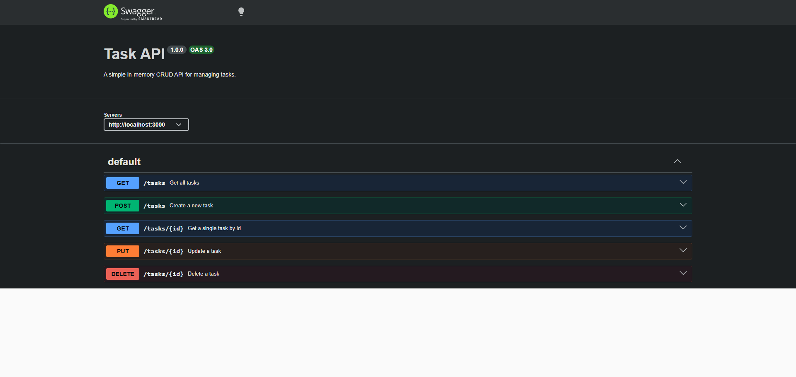

# Task API

A simple in-memory CRUD API for managing a to-do list, built with Node.js and Express.
Built as part of the FlyRank AI Backend Engineering track (Week 2, BE-01).

## How to run

\`\`\`bash
npm install
node server.js
\`\`\`

Server runs on `http://localhost:3000`. Swagger docs at `http://localhost:3000/docs`.

## Endpoints

| Method | Path         | Description             |
|--------|--------------|--------------------------|
| GET    | /            | API info                |
| GET    | /health      | Health check             |
| GET    | /tasks       | List all tasks           |
| GET    | /tasks/:id   | Get a single task        |
| POST   | /tasks       | Create a new task        |
| PUT    | /tasks/:id   | Update a task             |
| DELETE | /tasks/:id   | Delete a task             |

## Example request

\`\`\`bash
curl -i -X POST http://localhost:3000/tasks -H "Content-Type: application/json" -d "{\"title\":\"Buy milk\"}"
\`\`\`

\`\`\`
HTTP/1.1 201 Created
Content-Type: application/json; charset=utf-8

{"id":4,"title":"Buy milk","done":false}
\`\`\`

## Swagger UI

## Notes

Data is stored in memory only — restarting the server resets tasks back to the 3 seed examples. Persistence with a real database is planned for Week 3.