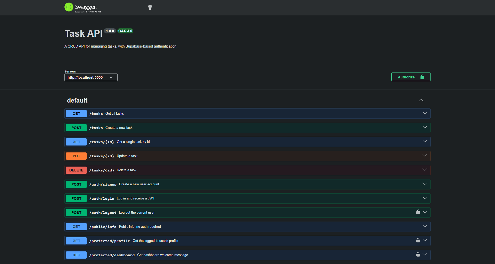
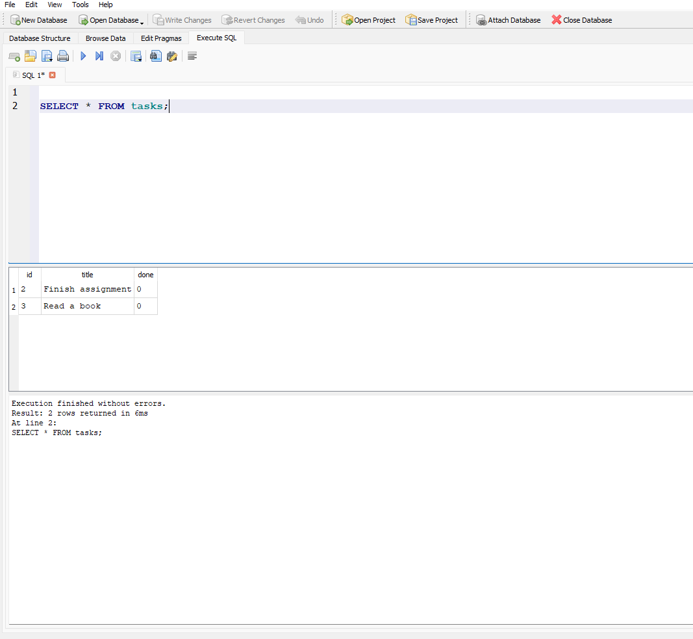

# Task API — Auth: Login & Protect

A CRUD API for managing a to-do list, built with Node.js and Express, backed by a containerized PostgreSQL database, and now secured with Supabase Auth (JWT-based authentication).
Built as part of the FlyRank AI Backend Engineering track — Week 4, Auth: Login & Protect (this repo's fourth stage: memory → SQLite → containerized Postgres → authenticated API).

## How to run

```bash
cp .env.example .env
# fill in your own SUPABASE_URL, SUPABASE_KEY, and DATABASE_URL in .env
docker compose up
npm run dev
```

Server runs on `http://localhost:3000`. Swagger docs at `http://localhost:3000/docs`.

Postgres comes up via Docker Compose (task storage). Supabase is a separate, hosted Identity Provider — no container needed for it, just your project URL and anon key in `.env`. On first run, the `tasks` table is created automatically and seeded with 3 example tasks. Stop everything with `docker compose down`; your data survives because it lives in a named Docker volume, not inside the container.

## What's new this week — Authentication

The API was previously wide open — anyone who knew the URL could read, create, or delete data. This week adds a full authentication layer using **Supabase Auth** as the Identity Provider:

- Users sign up and log in with email + password; Supabase hashes passwords and issues a signed JWT (access token) — this API never touches raw passwords or writes any crypto itself.
- Protected routes require `Authorization: Bearer <token>` and verify the token against Supabase before responding.
- A single reusable Express middleware (`requireAuth`) guards every protected route — the verification logic is written once and applied wherever it's needed.
- Swagger UI has a bearer-auth "Authorize" padlock, so protected routes can be tested directly from the browser after pasting in a token.

## Stack

| Layer | Technology |
|---|---|
| API | Node.js + Express |
| Database | PostgreSQL 16 (`postgres:16-alpine`) |
| Auth / Identity Provider | Supabase Auth (`@supabase/supabase-js`) |
| Driver | `pg` (node-postgres), parameterized queries (`$1`, `$2`, …) |
| Orchestration | Docker + Docker Compose |
| Secrets | `.env` (git-ignored), `.env.example` committed |
| Persistence | Named Docker volume (`taskdata`) |
| API docs | Swagger UI (`swagger-ui-express`), bearer auth configured |

## Endpoints

| Method | Path                  | Description                  | Auth required |
|--------|-----------------------|-------------------------------|----------------|
| GET    | /                     | API info                     | No             |
| GET    | /health               | Health check                  | No             |
| GET    | /tasks                | List all tasks                | No             |
| GET    | /tasks/:id            | Get a single task             | No             |
| POST   | /tasks                | Create a new task             | No             |
| PUT    | /tasks/:id            | Update a task                 | No             |
| DELETE | /tasks/:id            | Delete a task                 | No             |
| POST   | /auth/signup          | Create a new user account     | No             |
| POST   | /auth/login           | Log in, returns access token  | No             |
| POST   | /auth/logout          | End the user's session        | **Yes** — Bearer |
| GET    | /public/info          | Public, open info              | No             |
| GET    | /protected/profile    | Get logged-in user's profile  | **Yes** — Bearer |
| GET    | /protected/dashboard  | Dashboard welcome message      | **Yes** — Bearer |

## Example requests

**Sign up + log in:**
```bash
curl -i -X POST http://localhost:3000/auth/signup -H "Content-Type: application/json" -d "{\"email\":\"you@example.com\",\"password\":\"password123\"}"

curl -i -X POST http://localhost:3000/auth/login -H "Content-Type: application/json" -d "{\"email\":\"you@example.com\",\"password\":\"password123\"}"
```

**Call a protected route:**
```bash
curl -i http://localhost:3000/protected/profile -H "Authorization: Bearer <access_token>"
```

```
HTTP/1.1 200 OK
Content-Type: application/json; charset=utf-8

{"id":"...","email":"you@example.com","created_at":"..."}
```

**Create a task:**
```bash
curl -i -X POST http://localhost:3000/tasks -H "Content-Type: application/json" -d "{\"title\":\"Buy milk\"}"
```

## Environment variables

Copy `.env.example` to `.env` before running. Required keys:

```
SUPABASE_URL=your_supabase_project_url
SUPABASE_KEY=your_supabase_anon_key
PORT=3000
DATABASE_URL=postgres://postgres:dev@db:5432/tasks
```

`.env` is git-ignored — it never gets committed. `.env.example` holds the same keys with placeholder values so anyone cloning the repo knows what to set. Only the Supabase **anon** key is used here — the `service_role` key bypasses all security and is never used in this app.

## Swagger UI



Protected routes show a lock icon. Click **Authorize** in the top right, paste in an access token from `/auth/login`, and **Try it out** on any protected route directly from the browser.

## Database

Data lives in a Postgres container (`db` service), backed by the named volume `taskdata` — so it survives `docker compose down` / `docker compose up` cycles. User accounts and authentication live separately, inside Supabase's own managed `auth.users` table — this app never creates or migrates a schema for auth itself.



## Mistakes made & how they were fixed

**1. JSON syntax error in requests**
`SyntaxError: Expected double-quoted property name in JSON at position 30` — caused by single quotes or trailing commas in request bodies, or by sending a body on a `DELETE` request. Fixed by using strict double-quoted JSON and dropping the body entirely from `DELETE` calls.

**2. Table name mismatch**
`{ "error": "relation \"task\" does not exist" }` — SQL queries referenced the singular `task` while the table was created as `tasks`. Fixed by standardizing every CRUD query to the plural `tasks`.

**3. Missing Dockerfile during build**
`failed to solve: failed to read dockerfile` — the file was missing or saved with an unwanted extension. Fixed with a proper, extensionless `Dockerfile` at the root.

**4. Volume compatibility & port conflict**
Postgres logged a volume-compatibility warning, and `docker compose up` separately failed with a port-already-in-use error. Fixed by pinning `postgres:16-alpine`, clearing stale volumes with `docker compose down -v`, and killing the stray process already holding port 3000.

**5. Supabase "email rate limit exceeded" during testing**
Supabase's built-in email sender has a very low default rate limit, which got hit quickly during repeated signup testing (even with email confirmation turned off). Fixed by connecting a custom SMTP provider (Gmail, via an app password) under Project Settings → Authentication → SMTP Settings, which removes Supabase's built-in limiter entirely.

**6. New routes returning 404 despite correct, saved code**
`/public/info` and `/protected/profile` returned `Cannot GET ...` even though the code was confirmed correct and saved, and a diagnostic `console.log` proved the route was being registered on every restart. Root cause: `netstat -ano | findstr :3000` revealed **two separate processes** listening on port 3000 — an old, never-stopped `node server.js` process (bound to `[::1]:3000`, IPv6 localhost) alongside the current nodemon process. Windows resolves `localhost` to `::1` first, so requests were silently hitting the stale process, which had never seen the new routes. Fixed by killing both PIDs (`taskkill /F /PID <pid>`) and starting exactly one fresh instance. Lesson: if a route seems to "not exist" despite correct, saved code, check for duplicate processes on the port before assuming a code bug.

**7. Auth middleware silently hanging requests**
An early version of the `requireAuth` middleware verified the token correctly but never called `next()` on success — so every request to a protected route would hang indefinitely with no response, no error, and no timeout. Fixed by adding `req.user = data.user; next();` after a successful verification, so the request is explicitly handed off to the route handler.

## Key takeaways

- **Secrets stay out of code.** All configuration lives in `.env`; services talk to each other over Docker's internal network by service name (`db`), never `localhost` or a hardcoded address. Supabase keys follow the same rule.
- **Never roll your own auth.** Supabase handles password hashing and JWT signing; this API's job is only to receive, verify, and act on tokens — never to store or hash a password itself.
- **Persistence is real.** `docker compose down` followed by `docker compose up` keeps every task record — the named volume, not the container, owns the data.
- **A middleware must always resolve the request.** Either call `next()` to continue or send a response — doing neither leaves the client hanging with no error to debug from.
- **One command, any machine.** Clone the repo, `cp .env.example .env`, fill in real values, `docker compose up` + `npm run dev` — a working, authenticated stack in a few minutes.

## Notes

All CRUD operations use parameterized queries (`$1`, `$2`, …) via `pg`, keeping user input safe from SQL injection. This API has now run on three storage engines (memory → SQLite → Postgres) with identical routes and responses throughout, and this week added a full authentication layer on top without touching the existing task routes — proof that auth, like storage, is a layer you can add without rewriting what already works.