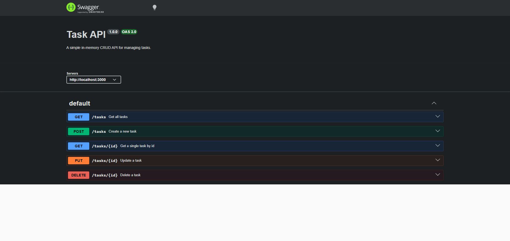

# Task API

A CRUD API for managing a to-do list, built with Node.js and Express, backed by a SQLite database.
Built as part of the FlyRank AI Backend Engineering track (Week 3, BE-A2 — sequel to Week 2's BE-01).

## How to run

\`\`\`bash
npm install
node --experimental-sqlite server.js
\`\`\`

Server runs on `http://localhost:3000`. Swagger docs at `http://localhost:3000/docs`.

On first run, `tasks.db` is created automatically with a `tasks` table and 3 seed examples. The database file is git-ignored, so every fresh clone starts clean.

## Why SQLite

SQLite needs no separate server or install — it's a single file (`tasks.db`) that lives right in the project folder. That made it the right fit here: zero configuration, and unlike the in-memory storage from Week 2, data now survives a server restart. The API's endpoints and responses are unchanged from Week 2 — only the storage layer underneath moved from a JavaScript array to disk.

## A note on the library

The assignment recommends `better-sqlite3`, but its installer requires a native C++ build step (Python + Visual Studio Build Tools), which failed on this machine due to a broken local Python setup. Instead, this project uses Node's built-in `node:sqlite` module (`DatabaseSync`), available experimentally in Node 22+. Its API (`.prepare()`, `.get()`, `.all()`, `.run()`) is deliberately modeled after `better-sqlite3`, so the code is functionally equivalent — synchronous calls, same parameterized-query pattern. Since it's still experimental, it requires the `--experimental-sqlite` flag when starting the server.

## Endpoints

| Method | Path         | Description             |
|--------|--------------|--------------------------|
| GET    | /            | API info                |
| GET    | /health      | Health check             |
| GET    | /tasks       | List all tasks           |
| GET    | /tasks/:id   | Get a single task        |
| POST   | /tasks       | Create a new task        |
| PUT    | /tasks/:id   | Update a task             |
| DELETE | /tasks/:id   | Delete a task             |

## Example request

\`\`\`bash
curl -i -X POST http://localhost:3000/tasks -H "Content-Type: application/json" -d "{\"title\":\"Buy milk\"}"
\`\`\`

\`\`\`
HTTP/1.1 201 Created
Content-Type: application/json; charset=utf-8

{"id":4,"title":"Buy milk","done":0}
\`\`\`

## Swagger UI

## Database

Data lives in `tasks.db`, a SQLite database created automatically on first run. It's git-ignored so each clone starts with a fresh seed of 3 example tasks.

Example query run directly in DB Browser: `SELECT * FROM tasks WHERE done = 1;` — returned only the tasks marked complete, confirming the API and DB Browser read and write the exact same file with no syncing needed.

## Notes

Data now persists across restarts (SQLite, `tasks.db`) — this fixes the Week 2 limitation where tasks reset on every restart. All CRUD operations use parameterized queries (`?` placeholders) to keep user input safe from SQL injection.